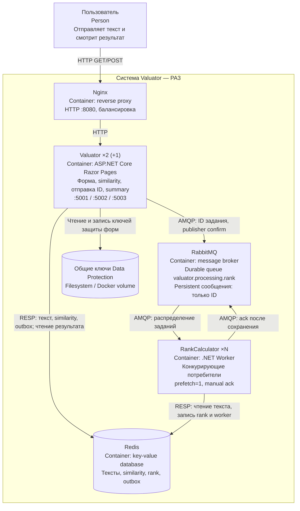

# C4: диаграмма контейнеров PA3

Редактируемая версия для защиты: [c4-containers.drawio](c4-containers.drawio).
Открыть файл в draw.io / diagrams.net. Контейнер C4 — исполняемое приложение
или хранилище, а не обязательно Docker-контейнер.

## Последовательность обработки

1. POST приходит через Nginx на любой Valuator.
2. Lua-скрипт Redis атомарно сохраняет текст, similarity и ID в outbox.
3. Valuator публикует ID в RabbitMQ. После подтверждения удаляет его из outbox.
   Если отправка не удалась, фоновый отправитель повторяет её.
4. Браузер получает 302 на summary. Если rank отсутствует, отображается
   «Оценка содержания не завершена» и страница обновляется через две секунды.
5. Один RankCalculator получает сообщение, читает текст из Redis, вычисляет rank,
   атомарно сохраняет результат и подтверждает обработку в RabbitMQ.
6. Любой экземпляр Valuator читает результат из общей базы и показывает его.

Доставка — at-least-once. Повторная обработка безопасна: записанный rank и
имя первого обработчика не заменяются. Неисполненные задания хранятся в outbox
либо в очереди; некорректные сообщения направляются в отдельную failed-очередь.
