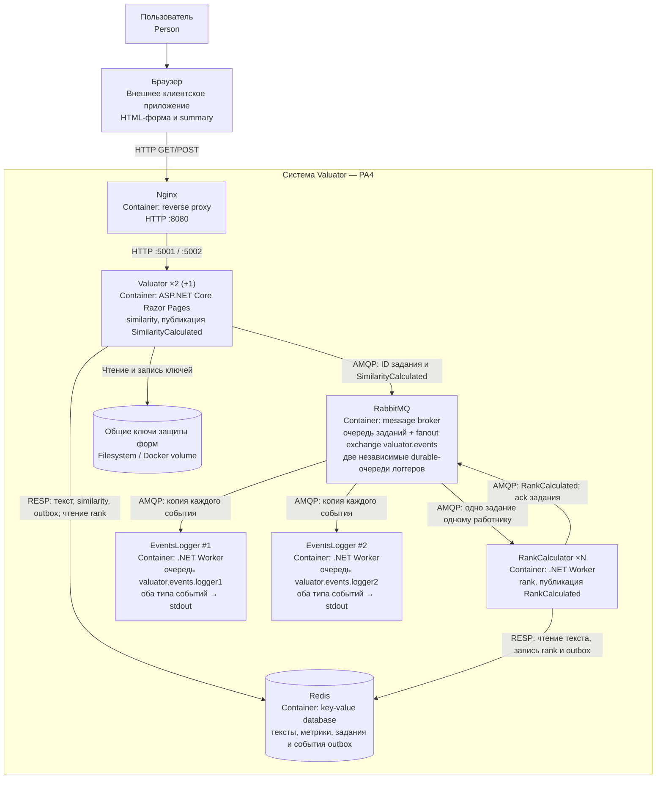

# C4: диаграмма контейнеров PA4

[Редактируемая диаграмма draw.io](c4-containers.drawio).
C4-контейнер — отдельное приложение или хранилище, не обязательно Docker-контейнер.



## Главное отличие от PA3

```text
Work Queue:
  Valuator → очередь заданий → один из RankCalculator

Publisher–Subscriber:
  Valuator ── SimilarityCalculated ─┐
                                  ├→ fanout exchange ─┬→ очередь logger1 → EventsLogger #1
  RankCalculator ─ RankCalculated ─┘                   └→ очередь logger2 → EventsLogger #2
```

**Оба** логгера получают **оба** события каждого текста. Общая очередь на двоих
дала бы конкурирующих потребителей и не выполнила бы требование Publisher–Subscriber.

## Порядок обработки

1. Браузер отправляет POST через Nginx в Valuator.
2. Valuator атомарно сохраняет текст, similarity, ID задания и событие
   SimilarityCalculated в Redis. Обработчик POST публикует событие и задание в RabbitMQ.
3. Браузер получает HTTP 302 на summary; незавершённый rank показывается как pending.
4. Один RankCalculator читает текст, вычисляет rank, атомарно сохраняет его и
   RankCalculated в Redis, публикует событие и подтверждает обработку задания.
5. Fanout exchange копирует каждое событие в две очереди. Логгеры выводят тип,
   TextId и значение метрики в свои консоли и подтверждают получение.
6. При недоступности брокера события остаются в outbox. Повторы выполняются
   процессом-источником: similarity — Valuator, rank — RankCalculator.

Порядок прихода двух типов событий не является контрактом. Доставка at-least-once:
возможны повторные строки с одинаковым EventId. Стенд не обещает exactly-once.
