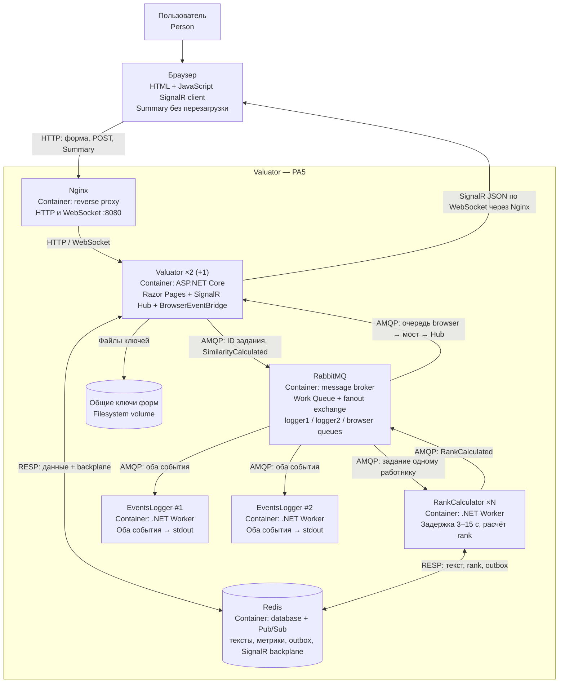

# C4: контейнеры PA5 — SignalR для браузера

[Редактируемый файл draw.io](c4-containers.drawio).
SignalR Hub и BrowserEventBridge находятся внутри контейнера Valuator,
а не являются отдельными процессами. Redis обслуживает и данные, и SignalR backplane.

## Путь результата в браузер

1. Пользователь отправляет текст; Valuator сохраняет его в Redis, публикует
   SimilarityCalculated и задание расчёта, возвращает 302 на Summary.
2. Браузер открывает WebSocket через Nginx, вызывает Subscribe с ID текста.
   Hub добавляет соединение в группу и отдаёт текущее состояние из Redis.
3. RankCalculator ждёт случайные 3–15 секунд, вычисляет rank, сохраняет значение
   и публикует RankCalculated.
4. RabbitMQ доставляет копии события обоим логгерам и в очередь browser.
5. Один BrowserEventBridge читает событие, загружает актуальный результат и
   вызывает SignalR для группы ID. Redis backplane передаёт уведомление на
   веб-экземпляры с подключёнными браузерами.
6. JavaScript меняет DOM Summary; нового HTTP-запроса страницы нет.

При переподключении повторяется Subscribe со снимком из Redis. События RabbitMQ
могут повторяться; клиент не возвращает уже готовый результат в pending-состояние.
