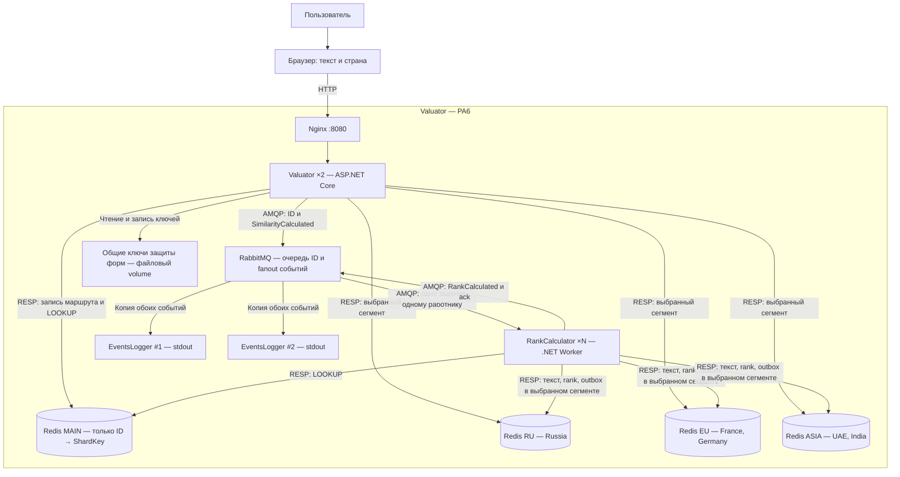

# C4: контейнеры Valuator — PA6

[Редактируемая диаграмма draw.io](c4-containers.drawio).

Каждый Redis — отдельный сервер с собственным volume. Связей Redis ↔ Redis нет.
Стрелки к трём сегментам обозначают возможные маршруты: одна операция по ID
использует только регион, найденный в MAIN. В каждом сегменте хранятся все данные
его текстов, включая страну, метрики и outbox. MAIN не используется для текстов,
метрик, ключей защиты форм или очередей.

1. Valuator проверяет страну, создаёт ID и сохраняет `ID → регион` в MAIN.
2. После LOOKUP Valuator атомарно пишет текст, страну, similarity и outbox
   в региональный Redis; публикует ID задания и событие SimilarityCalculated.
3. RankCalculator получает ID, выполняет LOOKUP, читает текст из найденного
   сегмента, рассчитывает rank и атомарно записывает rank и событие в тот же сегмент.
4. При чтении Summary Valuator снова получает маршрут из MAIN; страна из URL
   не определяет место чтения и не может перенаправить запрос в другой сегмент.
5. Каждый EventsLogger получает копии обоих событий, выводит их и подтверждает
   доставку. Логгерам не нужен доступ к БД.

Фоновые отправители обходят региональные outbox, а при работе с конкретным ID
повторно находят маршрут через MAIN. Подтверждение публикации удаляет запись
outbox только из соответствующего сегмента. Повторная доставка допустима.
