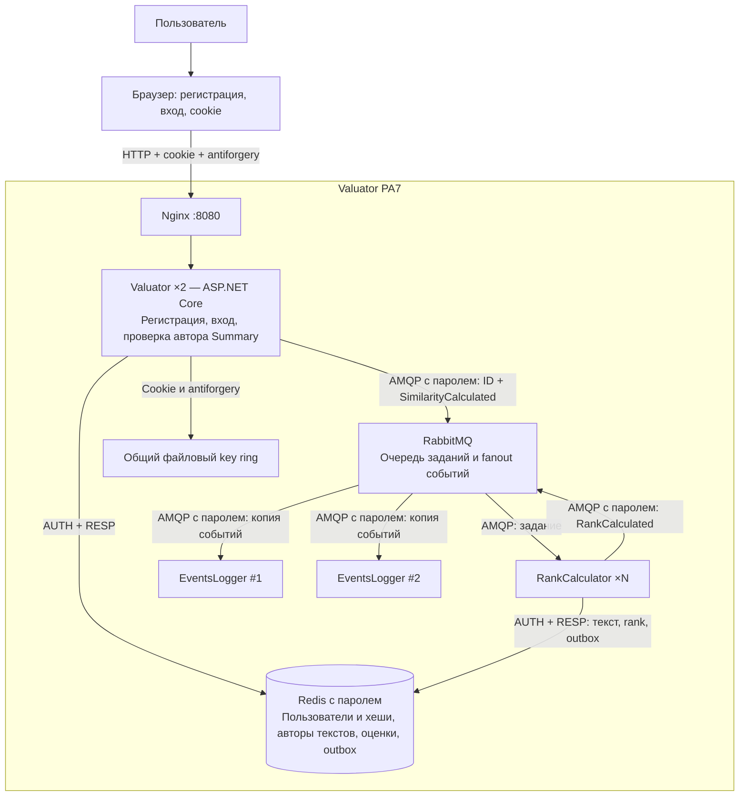

# C4: безопасность Valuator — PA7

[Редактируемая диаграмма draw.io](c4-containers.drawio).

Регистрация атомарно резервирует нормализованный логин в Redis. После проверки
PasswordHasher веб-сервис выдаёт зашифрованную cookie с ID и логином пользователя.
Общие ключи позволяют всем репликам распознавать одну сессию.

POST текста записывает ID автора из проверенной cookie. GET Summary сначала
проверяет аутентификацию, затем сравнивает сохранённого автора с ID пользователя.
Ни знание ID текста, ни подмена параметров формы не дают доступ к чужим результатам.

Пароли Redis/RabbitMQ загружаются из переменных окружения при запуске контейнеров.
Веб-пользователи не получают эти пароли. Redis и RabbitMQ остаются доверенными
сервисами внутри Compose-сети; браузер обращается только к Valuator через Nginx.
